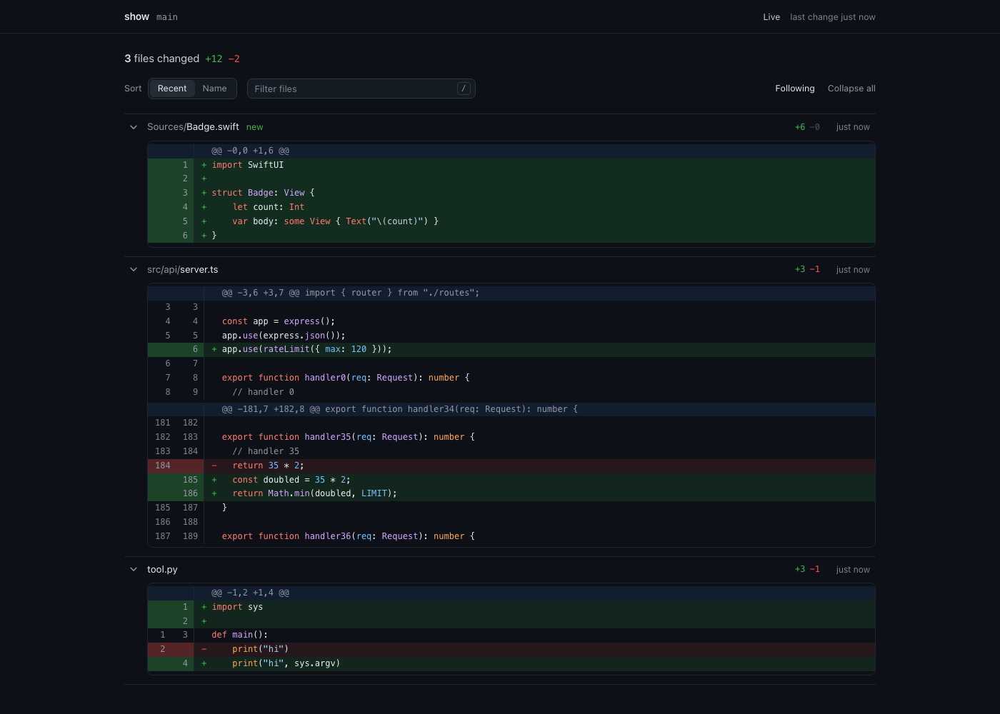

# gitdash

Watch the code in a git repo change as it happens.

`gitdash` opens a live dashboard in your browser that shows every uncommitted change in the repo you run it from, with the newest edit at the top and its diff open. It is built for watching coding agents work: as they edit files you see the diffs land in real time, and when they commit or stash you see that too.



## Install

```sh
curl -fsSL https://raw.githubusercontent.com/adammcarter/gitdash/main/install.sh | bash
```

This puts the latest release in `~/.local/bin/gitdash`. Set `GITDASH_INSTALL_DIR` to install somewhere else. Run the same line again to update.

Requires Python 3.9 or newer and git. Nothing else to install.

## Use

```sh
cd any/git/repo
gitdash
```

Your browser opens on the dashboard. Leave it running; press Ctrl-C to stop.

| Option | |
|---|---|
| `--port N` | Listen on a fixed port instead of a free one |
| `--no-open` | Don't open the browser |
| `--version` | Print the version |

## What it shows

- **Everything not yet committed**: staged and unstaged edits, new files, deletions and renames, compared with your last commit. Ignored files never appear.
- **A live feed**: the most recently changed file is at the top with its diff open. Lines that just changed glow briefly.
- **Following**: the page scrolls to each new edit. Scroll yourself and it pauses; click Follow to resume.
- **Events**: commits, stashes, branch switches, resets and pulls are announced as they happen, so a clean working tree never comes as a surprise.
- **Name view**: switch the sort to Name to group files under Added, Modified and Deleted.
- Syntax highlighting with the GitHub Dark theme, a filter box (press `/`), and collapse or expand all.

## Safe to leave running

`gitdash` only reads. It never writes to your repo or takes git's index lock, so it cannot get in the way of you or an agent committing. It listens on 127.0.0.1 only.

Syntax highlighting loads [highlight.js](https://highlightjs.org) from cdnjs. Offline, diffs still work without colour. Your code never leaves your machine.

## Releasing

Push a tag and GitHub Actions does the rest:

```sh
git tag v0.2.0
git push origin v0.2.0
```

The release workflow runs the smoke test, stamps the version into the script and attaches it to a new GitHub release, which the install line picks up.

## License

MIT
